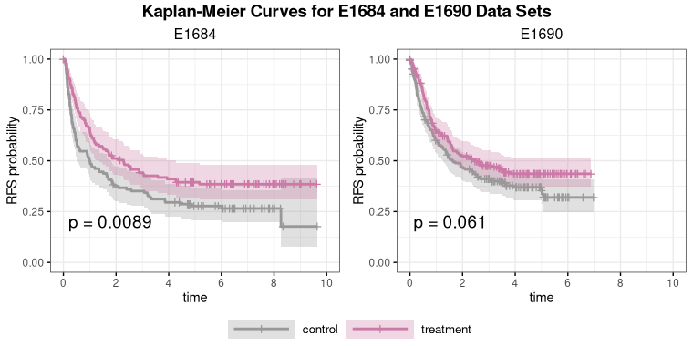
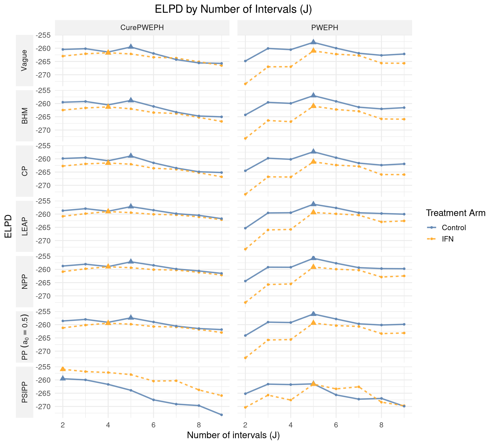
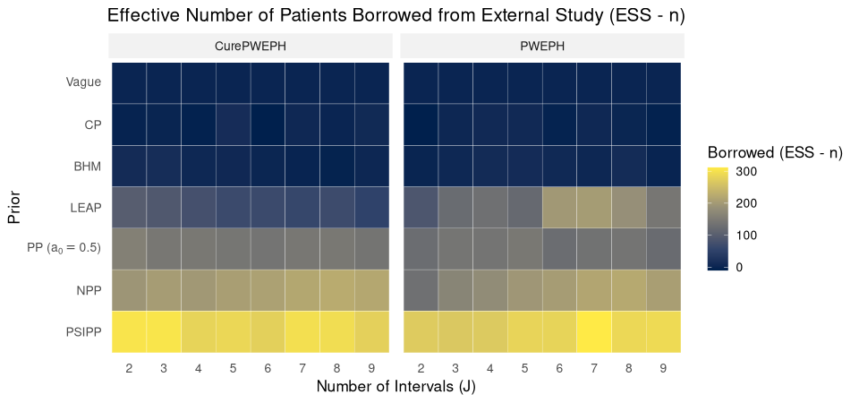
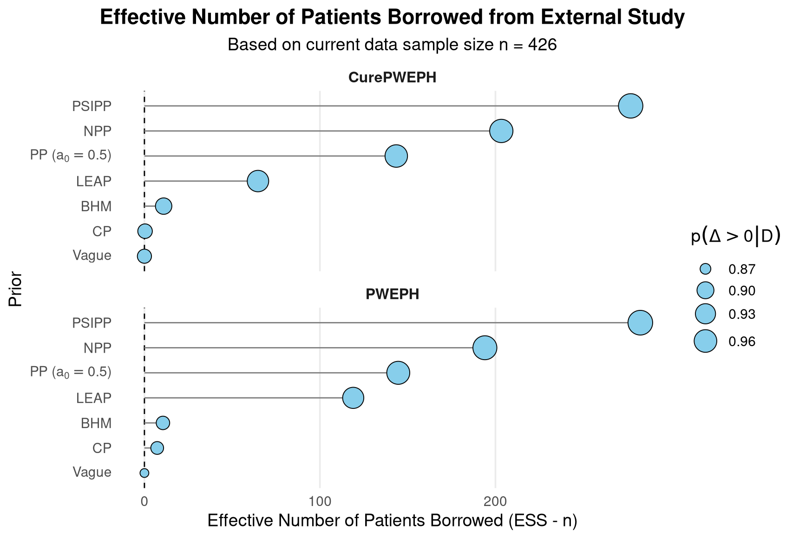
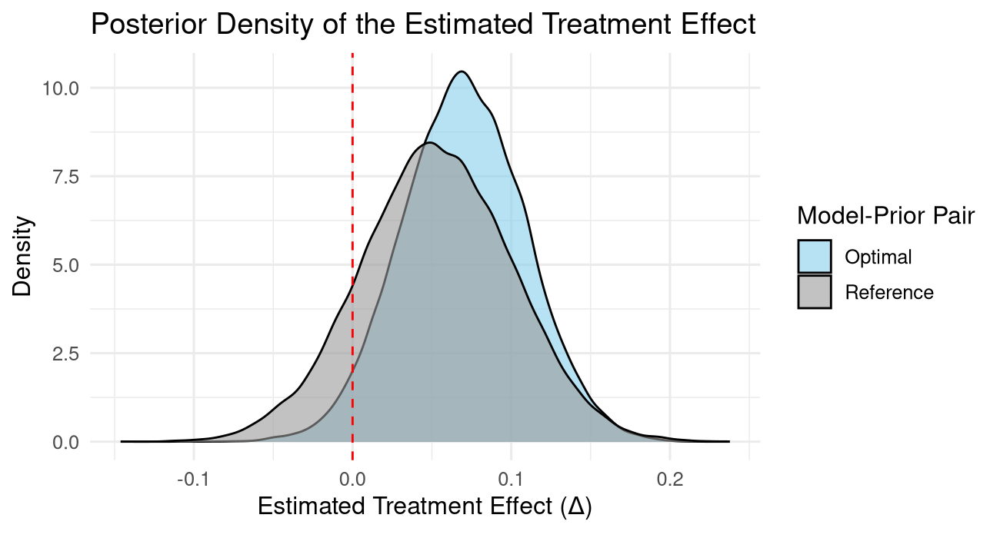

Here, we illustrate the analysis of relapse-free survival (RFS) in the E1690 trial (treated as the current study) while incorporating information from the E1684 trial (treated as the external study), following the procedures described in Section 3.1 of the manuscript.

```{r setup, message=FALSE}
library(tidyverse)
library(gtsummary)
library(survival)
library(survminer)
library(hdbayes)
library(posterior)
library(ggplot2)
library(ggpubr)
library(latex2exp)
library(kableExtra)
library(tables)
library(ggthemes)
```


# Summary of Baseline Covariate

```{r}
# Load and pre-process data
hist <- E1684 # external data
curr <- E1690 # current data

# Replace 0-day failure times with 0.50 days (converted to years)
hist <- hist %>% mutate(failtime = if_else(failtime == 0, 0.50/365.25, failtime)) 
curr <- curr %>% mutate(failtime = if_else(failtime == 0, 0.50/365.25, failtime)) 

# Center and scale age
hist$cage <- scale(hist$age, center = T, scale = T)
curr$cage <- scale(curr$age, center = T, scale = T)
```

```{r}
# Create a summary table of baseline covariates 
df       <- rbind(curr, hist) %>%
  mutate(
    Treatment = case_when(
      treatment == 1 ~ "Treatment",
      TRUE ~ "Control"
    ),
    Sex = factor(sex, levels = c(0, 1), labels = c("Male", "Female")),
    `Having > 1 cancerous lymph node` = case_when(
      `node_bin` == 1 ~ "Yes (> 1 node)",
      TRUE ~ "No (0 or 1 node)"
    ),
    Age = age
  )
df$Study <- rep(c("E1690", "E1684"), times = c(nrow(curr), nrow(hist)))

tab <- df %>%
  select(all_of(c("Treatment", "Sex", "Age", "Having > 1 cancerous lymph node", "Study"))) %>%
  tbl_summary(
    by = Study,
    statistic = list(
      all_continuous() ~ "{mean} ({sd})",
      all_categorical() ~ "{n} ({p}%)"
    ),
    digits = all_continuous() ~ 2
  ) %>%
  modify_header(label ~ "**Variable**",
                `stat_1` ~ "E1684, N = 262",
                `stat_2` ~ "E1690, N = 426")
tab
```


# Kaplan-Meier Curves for E1684 and E1690

```{r, eval=FALSE}
# Create KM plots
curr2 <- df[df$Study == "E1690", ]
hist2 <- df[df$Study == "E1684", ]

km_fit1 <- survfit(Surv(failtime, failcens) ~ Treatment, data = curr2)
km_fit2 <- survfit(Surv(failtime, failcens) ~ Treatment, data = hist2)

xlim_range <- c(0, 10)
p1   <- survminer::ggsurvplot(km_fit1, 
                      data = curr2, 
                      pval = TRUE,
                      conf.int = TRUE,
                      palette = c("#999999", "#CC79A7"),
                      legend.labs = c("control", "treatment"),
                      ggtheme = theme_bw(),
                      xlim = xlim_range)$plot + 
  labs(subtitle = "E1690", color = "", fill = "", x = "time", y = "RFS probability") +
  theme(legend.position = "bottom",
        legend.text=element_text(size=10),
        legend.key.width= unit(2, 'cm'), 
        plot.subtitle = element_text(hjust = 0.5, size = 12)) +
  scale_x_continuous(limits = xlim_range, breaks = pretty(xlim_range))

p2   <- survminer::ggsurvplot(km_fit2, 
                      data = hist2,
                      pval = TRUE,
                      conf.int = TRUE,
                      palette = c("#999999", "#CC79A7"),
                      legend.labs = c("control", "treatment"),
                      ggtheme = theme_bw(),
                      xlim = xlim_range)$plot + 
  labs(subtitle = "E1684", color = "", fill = "", x = "time", y = "RFS probability") +
  theme(legend.position = "bottom",
        legend.text=element_text(size=10),
        legend.key.width= unit(2, 'cm'), 
        plot.subtitle = element_text(hjust = 0.5, size = 12)) +
  scale_x_continuous(limits = xlim_range, breaks = pretty(xlim_range))

KM_plts <- ggarrange(p2, p1, ncol=2, nrow=1, common.legend = TRUE, legend="bottom")
annotate_figure(KM_plts, top = text_grob("Kaplan-Meier Curves for E1684 and E1690 Data Sets", face = "bold", size = 14))
```


```{r km-plot, echo = FALSE, fig.cap="Kaplan–Meier curves for control and treatment arms in E1684 and E1690 studies", out.width="90%"}

```


# Results from Cox Proportional Hazards Model

We fit Cox proportional hazards (PH) models separately to the E1690 and E1684 studies to estimate the effects of treatment while adjusting for key baseline covariates, including sex (0 = male; 1 = female), standardized age, and an indicator for having  multiple involved lymph nodes (0 = one; 1 = multiple).

```{r}
fmla <- Surv(failtime, failcens) ~ treatment + sex + cage + node_bin

# Fit a Cox PH model to E1690 data
fit <- coxph(formula = fmla, data = curr)
summary(fit)
```

```{r}
# Fit a Cox PH model to E1684 data
fit.hist <- coxph(formula = fmla, data = hist)
summary(fit.hist)
```


# Bayesian Analysis 

Following previous analyses of these data sets, we considered two survival models: 
(1) a proportional hazards model with a piecewise constant baseline hazard (referred to as the piecewise exponential proportional hazards (PWEPH) model), and 

(2) a mixture cure rate model in which a fraction $\pi$ of the population is assumed to be cured, i.e., not at risk of the event during the study follow-up period. The population survival function under the mixture cure rate model takes the form

$$
    S_{\text{pop}}(t) = \pi + (1 - \pi) S(t),
$$
where $S(t)$ denotes the survival function for the non-cured population, modeled using a PWEPH structure. Covariate effects were incorporated through the PWEPH component only, and no separate model was specified for the cure fraction $\pi$. We refer to this mixture cure rate model as the CurePWEPH model.

Our goal is to conduct posterior inference on the difference in two-year RFS probabilities between the treatment and control arms, denoted as the treatment effect $\Delta$.


## Likelihood Function 

Let $D = (\boldsymbol{y}, \boldsymbol{\nu}, \boldsymbol{X}, n)$ denote the current data, where $\boldsymbol{y} = (y_1, \ldots, y_n)'$ is the vector of observed event or censoring times, $\boldsymbol{\nu} = (\nu_1, \ldots, \nu_n)'$ is the vector of event indicators with $\nu_i = 1$ if subject $i$ had an event and 0 otherwise, and $\boldsymbol{X}$ is the $n \times p$ matrix of covariates with $i$th row $\boldsymbol{x}_i'$.

To define the piecewise constant baseline hazard for the PWEPH model and the PWEPH component of the CurePWEPH model, we partition the time axis into $J$ intervals: $0 = s_0 < s_1 < \ldots < s_{J-1} < s_J = \infty$, with breakpoints chosen so that each interval contains approximately the same number of events in the current data. Let $\boldsymbol{\beta} = (\beta_1, \ldots, \beta_p)'$ denote the vector of regression coefficients, and $\boldsymbol{\lambda} = (\lambda_1, \ldots, \lambda_J)'$ denote the vector of baseline hazards across the $J$ intervals.

### PWEPH Model

Under a PWEPH model, we can write the current data likelihood function as 
$$\begin{aligned}
    \mathcal{L}(\boldsymbol{\beta}, \boldsymbol{\lambda} \mid D) = \prod_{i=1}^{n} \prod_{j = 1}^{J} (\lambda_j \exp\{\boldsymbol{x}_i' \boldsymbol{\beta}\})^{\delta_{ij} \nu_i} \exp\left\{-\delta_{ij} \left[\lambda_j (y_i - s_{j-1}) + \sum_{g=1}^{j-1}(s_g - s_{g-1})\right] \exp\{\boldsymbol{x}_i' \boldsymbol{\beta}\}\right\},
\end{aligned}$$
where $\delta_{ij} = 1$ if the $i$ subject had an event or was censored in the $j$th interval, and 0 otherwise. 

### CurePWEPH Model

Let $f(\cdot \mid \boldsymbol{x}, \boldsymbol{\beta}, \boldsymbol{\lambda})$ and $S(\cdot \mid \boldsymbol{x}, \boldsymbol{\beta}, \boldsymbol{\lambda})$ denote the density and survival functions under a PWEPH model given the covariates $\boldsymbol{x}$. The likelihood for the current data under a CurePWEPH model is given by
$$\begin{aligned}
    \mathcal{L}(\pi, \boldsymbol{\beta}, \boldsymbol{\lambda} \mid D) = \prod_{i=1}^{n} \Big[ \big\{(1 - \pi) f(y_i \mid \boldsymbol{x}_i, \boldsymbol{\beta}, \boldsymbol{\lambda})\big\}^{\nu_i} \cdot \big\{\pi + (1 - \pi) S(y_i \mid \boldsymbol{x}_i, \boldsymbol{\beta}, \boldsymbol{\lambda})\big\}^{1 - \nu_i} \Big].
\end{aligned}$$

For both the PWEPH and CurePWEPH models, we stratified the data sets by treatment arm and considered the number of intervals ($J$) for the piecewise constant baseline hazards varying from 2 to 9. For each model, we considered the following list of priors for analysis: a vague (non-informative) prior, Bayesian hierarchical model (BHM), commensurate prior (CP), power prior (PP) with the discounting parameter $a_0 = 0.5$, normalized power prior (NPP), latent exchangeability prior (LEAP), and propensity score-integrated power prior (PSIPP). 

When fitting a PWEPH or CurePWEPH model under non-PSIPP priors, we adjusted for baseline covariates including gender (0 = male; 1 = female), standardized age (centered and scaled by the sample mean and standard deviation), and an indicator for multiple involved lymph nodes (0 = one; 1 = multiple). When fitting a PWEPH or CurePWEPH model under PSIPP, we first estimated propensity scores (PS) using a logistic regression model fit to the pooled current and external data sets, with study membership as the outcome (1 = current study, 0 = external study). The model included an intercept and the same baseline covariates used in the survival models (i.e., PWEPH or CurePWEPH) under non-PSIPP priors. Based on the estimated PS, all subjects were stratified into four strata using PS quantiles. Within each stratum, we applied the PP with a stratum-specific discounting parameter $a_{0, k}$ for $k \in \{1, \ldots, 4\}$, computed based on the degree of overlap between the PS distributions of the current and external data. A simplified survival model without any baseline covariates was then fit within each stratum, as covariate balance was achieved through the PS stratification. 


## Load Compiled Anlalysis Results

```{r}
res <- readRDS(file = "../results/compiled_results/compiled_analysis_results.rds")
```


## Selection of the Number of Intervals via ELPD

To determine the optimal number of intervals, we evaluated models with $J$ ranging from 2 to 9 and selected the value that maximized the expected log predictive density (elpd). The following figure presents the elpd values across different numbers of intervals ($J = 2$ to 9), stratified by prior and model type (CurePWEPH or PWEPH) for both treatment arms.

```{r, eval=FALSE}
# Combine epld tables from both treatment arms
elpd.tab <- rbind(res$elpd.tab.trt, res$elpd.tab.ctl)
# Label arms: IFN = treatment, Control = control
elpd.tab$arm <- rep(
  c("IFN", "Control"),
  times = c(nrow(res$elpd.tab.trt), nrow(res$elpd.tab.ctl))
)
# Parse model label into {model, J}
elpd.tab <- elpd.tab %>%
  extract(col = model, 
          into = c("model", "J"), 
          regex = "((?:[A-Za-z]+)?PWE) \\(J = ([2-9]+)\\)") %>%
  mutate(J = as.numeric(J))

# Recode prior/model labels for display
elpd.tab$prior <- recode(
  elpd.tab$prior, leap = "LEAP", npp = "NPP", pp = "PP~(a[0] == 0.5)",
  ref = "Vague", bhm = "BHM", cp = "CP", psipp = "PSIPP"
)
elpd.tab$model <- recode(
  elpd.tab$model, CurePWE = "CurePWEPH", PWE = "PWEPH"
)
elpd.tab <- elpd.tab %>% 
  mutate(prior = factor(prior, 
                        levels = c("Vague", "BHM", "CP", "LEAP", 
                                   "NPP", "PP~(a[0] == 0.5)", "PSIPP")), 
         model = factor(model, levels = c("CurePWEPH", "PWEPH")))

# Identify the J with the maximum elpd within each (arm, prior, model) combination
max_pts <- elpd.tab %>%
  group_by(arm, prior, model) %>%
  slice_max(elpd, n = 1, with_ties = FALSE) %>%
  ungroup()

# Create elpd plot
elpd_plt <- ggplot(elpd.tab, aes(x = J, y = elpd, color = arm, linetype = arm)) +
  geom_line(linewidth = 1, alpha = 0.9, aes(group = arm)) +
  geom_point(size = 1.5, shape = 16) +
  # Use triangle markers highlight the J that maximizes elpd in each panel
  geom_point(
    data = max_pts,
    shape = 17,
    size = 3,
    show.legend = FALSE
  ) +
  facet_grid(rows = vars(prior), cols = vars(model), switch = "y",
             labeller = label_parsed) +
  labs(
    title = "ELPD by Number of Intervals (J)",
    x = "Number of intervals (J)",
    y = "ELPD",
    color = "Treatment Arm",
    linetype = "Treatment Arm"
  ) +
  theme_minimal(base_size = 14) +
  theme(
    panel.spacing.y = unit(6, "pt"),
    panel.spacing.x = unit(12, "pt"),
    strip.placement = "outside",
    strip.background = element_rect(fill = "grey95", color = NA),
    plot.title = element_text(hjust = 0.5) 
  ) +
  scale_color_tableau("Superfishel Stone")

elpd_plt
```


```{r elpd-plot, echo = FALSE, fig.cap="Expected log predictive density (elpd) as a function of the number of intervals (J)"}

```


## Posterior Summaries of Two-Year RFS Probabilities

Within each treatment arm, we selected the number of intervals $J$ that achieved the highest elpd for each combination of prior and model type (CurePWEPH or PWEPH). 

```{r}
# Function to summarize posterior draws of S(2) by arm, keeping only the (prior, model)
# pair that achieved the highest elpd value
estim.by.arm <- function(samples_list, elpd_tab){
   # Compute posterior mean and standard deviation (SD)
  estim <- lapply(samples_list, function(l){
    c(mean = mean(l), sd = sd(l))
  })
  estim <- do.call(rbind, estim) %>%
    as.data.frame()
  estim <- cbind(model = res$models,
                 prior = res$priors,
                 estim) %>%
    as.data.frame()
  rownames(estim) <- NULL
  
  # For each combination of prior and model type, keep the single row with the max elpd value.
  elpd_tab_max <- elpd_tab %>% 
    mutate(is_CurePWE = grepl("CurePWE \\(J = \\d+\\)", model)) %>%
    group_by(prior, CurePWE_group = if_else(is_CurePWE, "CurePWE", "PWE")) %>%
    filter(elpd == max(elpd)) %>%
    ungroup()
  
  estim <- merge(
    estim, elpd_tab_max[, c("model", "prior", "elpd")], 
    by = c("model", "prior")
  )
  
  return( as.data.frame(estim) )
}
```


```{r}
# Posterior summaries for each arm
# IFN (treatment) arm
estim.trt <- estim.by.arm(samples_list = res$surv.trt.list, elpd_tab = res$elpd.tab.trt)
# Control arm
estim.ctl <- estim.by.arm(samples_list = res$surv.ctl.list, elpd_tab = res$elpd.tab.ctl)
```


The treatment effect was then computed as the difference in the estimated two-year relapse-free survival (RFS) probabilities between the treatment (IFN) and control arms, using the selected model–prior combination for each arm.

```{r}
# Keys for full result index
keys_all <- paste(res$models, res$priors)

# Keys for the treatment-arm table
keys_trt <- paste(estim.trt$model, estim.trt$prior)
# Find matched row indices for treatment arm
matching_indices_trt <- match(keys_trt, keys_all)

model_prior_trt <- paste0(sub(" \\(J = \\d+\\)", "", estim.trt$model), '_', estim.trt$prior)
# Extract the corresponding posterior draws for the treatment arm
surv.trt.list <- res$surv.trt.list[matching_indices_trt]
names(surv.trt.list) <- model_prior_trt

# Keys for the control-arm table
keys_ctl <- paste(estim.ctl$model, estim.ctl$prior)
matching_indices_ctl <- match(keys_ctl, keys_all)

model_prior_ctl <- paste0(sub(" \\(J = \\d+\\)$", "", estim.ctl$model), "_", estim.ctl$prior)
# Extract the corresponding posterior draws for the control arm
surv.ctl.list <- res$surv.ctl.list[matching_indices_ctl]
names(surv.ctl.list) <- model_prior_ctl

common_keys <- intersect(names(surv.trt.list), names(surv.ctl.list))
# Obtain posterior draws of the difference in two-year RFS probabilities
surv.diff.list <- lapply(common_keys, function(i){
  surv.trt.list[[i]] - surv.ctl.list[[i]]
})
names(surv.diff.list) <- common_keys
# Summarize posterior draws of the difference in two-year RFS probabilities
estim.diff <- lapply(surv.diff.list, function(l){
  c(mean = mean(l), sd = sd(l),
    quantile2(l, probs = c(0.025, 0.975)),
    prob_greater_0 = mean(l > 0))
})
estim.diff <- do.call(rbind, estim.diff) %>%
  as.data.frame()

# Create table of posterior summaries for the difference in two-year RFS probabilities
model_prior_df <- do.call(rbind, strsplit(rownames(estim.diff), "_")) %>% 
  as.data.frame()
estim.diff <- cbind(model = model_prior_df[, 1], 
                    prior = model_prior_df[, 2], 
                    estim.diff) %>%
  as.data.frame()
rownames(estim.diff) <- NULL

# Remove the "(J = ...)" suffix in model
estim.trt$model <- ifelse(
  grepl("^CurePWE \\(J = \\d+\\)$", estim.trt$model),
  "CurePWE", "PWE"
)
estim.ctl$model <- ifelse(
  grepl("^CurePWE \\(J = \\d+\\)$", estim.ctl$model),
  "CurePWE", "PWE"
)
```


### Create Table of Posterior Summaries

We report posterior summaries of the estimated two-year RFS probabilities under the elpd-selected model-prior pairs for each arm, along with the posterior summaries of the treatment effect $\Delta = \hat{S}_1(2) - \hat{S}_0(2)$. 

```{r}
# Function to format a credible interval (l, u) as a string for LaTeX
textci <- function(lower, upper, digits = 3, mathmode = TRUE) {
  lower.ch <- formatC(lower, digits = digits, format = 'f')
  lower.ch[lower > 0] <- paste0('~', lower.ch[lower > 0])
  upper.ch <- formatC(upper, digits = digits, format = 'f')
  upper.ch[upper > 0] <- paste0('~', upper.ch[upper > 0])
  ci <- paste0('(', lower.ch, ', ', upper.ch, ')')
  if (mathmode)
    ci <- paste0('$', ci, '$')
  ci
}
```


```{r}
# Combine arm-specific summaries and treatment-effect summaries
estim.combined <- full_join(estim.trt, estim.ctl, by = c("model", "prior"), 
                            suffix = c(".trt", ".ctl")) %>%
  full_join(estim.diff, by = c("model", "prior"))

# Recode prior and model labels
estim.combined$prior <- recode(
  estim.combined$prior, leap = "LEAP", npp = "NPP", pp = "PP~$(a_0 = 0.5)$",
  ref = "Vague", bhm = "BHM", cp = "CP", psipp = "PSIPP"
)
estim.combined$model <- recode(
  estim.combined$model, CurePWE = "CurePWEPH", PWE = "PWEPH"
)
estim.combined <- estim.combined %>% 
  mutate(prior = factor(prior, 
                        levels = c("Vague", "BHM", "CP", "LEAP",  
                                   "NPP", "PP~$(a_0 = 0.5)$", "PSIPP")), 
         model = factor(model, levels = c("CurePWEPH", "PWEPH"))) %>%
  arrange(model, prior)

# Create table of posterior summaries 
ndigits <- 3
tab.estim.combined <- estim.combined %>%
  mutate(across(where(is.numeric), \(x) round(x, ndigits))) %>%
  mutate(CI = textci(`q2.5`, `q97.5`, digits = ndigits)) %>% 
  dplyr::select(-`q2.5`, -`q97.5`)
tab <- tab.estim.combined %>%
  rename(
    Model = model,
    Prior = prior,
    Mean  = mean,
    SD    = sd,
    `$p(\\Delta > 0 \\mid D)$` = prob_greater_0,
    `$95\\%$ CI`       = CI
  ) %>%
  dplyr::select(Model, Prior, mean.trt, sd.trt, mean.ctl, sd.ctl, 
                Mean, SD, `$p(\\Delta > 0 \\mid D)$`, `$95\\%$ CI`)
colnames(tab)[3:6] <- rep(c("Mean", "SD"), 2)
```

```{r}
tab.final <- kbl(tab, 
                 format = "html", # format = "latex"
                 booktabs = TRUE,
                 caption = "Posterior Summaries of $\\Delta$ from PWEPH and CurePWEPH Models under Various Priors",
                 escape = FALSE, digits = ndigits, 
                 align = "llcccccccc") %>%
  add_header_above(c(" " = 2, "IFN" = 2, "Control" = 2, "$\\Delta$" = 4))

tab.final %>% 
  kable_styling(
    bootstrap_options = c("striped", "hover"),
    full_width = TRUE,    
    position = "center",
    font_size = 14
  )
```


## Effective Sample Size (ESS)

To quantify the amount of external information incorporated, we computed the effective sample size (ESS) for each model-prior combination. For a given outcome model $M$ and prior distribution $\pi$, the ESS is defined as
$$\text{ESS} = n \cdot \frac{V_{(M, ~\pi_{v})}}{V_{(M, ~\pi)}},$$
where $n$ is the sample size of the current trial, $V_{(M, ~\pi_v)}$ denotes the posterior variance of the treatment effect under model $M$ with the vague prior $\pi_v$, and $V_{(M, ~\pi)}$ denotes the posterior variance under the same outcome model $M$ with prior $\pi$ (which may be informative). Intuitively, the ESS represents the number of subjects that would be required in the current trial, without incorporating external information, to achieve the same posterior variance as obtained when leveraging the external study. Hence, the difference $(\text{ESS} - n)$ can be interpreted as the effective number of subjects borrowed from the external study. 


### Create Heatmap of (ESS - n)

The heatmap below shows the amount of information borrowing across different numbers of intervals ($J$) for each combination of prior and model type (CurePWEPH or PWEPH), with darker blue indicating less borrowing and yellow indicating more borrowing from the external study. 

```{r, eval=FALSE}
# Current study sample size
n_curr <- nrow(curr)

# Posterior summaries for the difference in two-year RFS probabilities under each model-prior pair
estim.diff <- tibble(
  model = res$models,
  prior = res$priors
) %>%
  bind_cols(as.data.frame(res$estim)) %>%
  select(-any_of(c("q50", "q2.5", "q97.5"))) %>%
  as.data.frame()
rownames(estim.diff) <- NULL
estim.diff <- estim.diff %>%
  extract(model, into = c("model", "J"), regex = "((?:[A-Za-z]+)?PWE) \\(J = ([2-9]+)\\)") %>%
  mutate(J = as.numeric(J))

# Compute ESS and 'nborrowed' for each (model, J) under each prior
# V_ref     = posterior variance (sd^2) under the vague prior for the same model
# V_inform  = posterior variance under the given prior for the same model
# ESS       = n_curr * (V_ref / V_inform)
# nborrowed = ESS - n_curr
ess_df <- estim.diff %>%
  group_by(model, J) %>%
  mutate(
    V_ref     = sd[prior == "ref"]^2, 
    V_inform  = sd^2, 
    ESS       = n_curr * (V_ref / V_inform), 
    nborrowed = ESS - n_curr
  ) %>%
  ungroup()

# Recode prior and model labels
ess_df$prior <- recode(
  ess_df$prior, leap = "LEAP", npp = "NPP", pp = "PP ($a_0 = 0.5$)",
  ref = "Vague", bhm = "BHM", cp = "CP", psipp = "PSIPP"
)
ess_df$model <- recode(
  ess_df$model, CurePWE = "CurePWEPH", PWE = "PWEPH"
)

# Create heatmap
ess_plot_heatmap <- ess_df %>%
  mutate(
    J = factor(J, levels = 2:9),
    prior = factor(prior, levels = c("PSIPP", "NPP", "PP ($a_0 = 0.5$)", "LEAP", "BHM", "CP", "Vague")), 
    model = factor(model, levels = c("CurePWEPH", "PWEPH"))
  ) %>%
  ggplot(aes(x = J, y = prior, fill = nborrowed)) +
  geom_tile(color = "white") +
  scale_fill_viridis_c(option = "cividis", name = "Borrowed (ESS - n)") +
  facet_wrap(~model, ncol = 2) +
  scale_y_discrete(labels = function(x) TeX(x)) +
  labs(
    title = "Effective Number of Patients Borrowed from External Study (ESS - n)",
    x = "Number of Intervals (J)",
    y = "Prior"
  ) +
  theme_minimal(base_size = 13) +
  theme(
    panel.grid = element_blank(),
    axis.text.x = element_text(angle = 0, hjust = 0.5), # keep integers upright
    strip.background = element_rect(fill = "grey95", color = NA),
    plot.title = element_text(hjust = 0.5)
  )
ess_plot_heatmap
```


```{r heatmap-plot, echo = FALSE, fig.cap="Effective number of patients borrowed from external data (ESS - n) by number of intervals (J), stratified by prior (rows) and model type", out.width="90%"}

```


### Create Lollipop Plot

To make a fair comparison of the amount of external information borrowed, we fixed the outcome model by choosing the number of intervals $J$ that maximized the elpd under the vague prior for each model type within each treatment arm. This ensures that differences in $(\text{ESS} - n)$ reflect only the choice of prior rather than variation in the underlying outcome model. Specifically, we set $J = 4$ for the IFN arm and $J = 5$ for the control arm under the CurePWEPH model, and $J = 5$ for both treatment arms under the PWEPH model. The following figure presents the effective number of subjects borrowed from the external study for each prior under these selected models. 

```{r, eval=FALSE}
# For IFN (treatment) arm
model_trt <- c("CurePWE (J = 4)", "PWE (J = 5)")
# For Control arm
model_ctl <- c("CurePWE (J = 5)", "PWE (J = 5)")

# Indices of the selected models in the full results
idx_trt <- which(res$models %in% model_trt)
idx_ctl <- which(res$models %in% model_ctl)
# Extract the posterior draws for S(2) for the selected models
surv.trt.list <- res$surv.trt.list[idx_trt]
surv.ctl.list <- res$surv.ctl.list[idx_ctl]

# Compute treatment effect for each selected model
surv.diff.list <- lapply(seq_along(surv.trt.list), function(i){
  surv.trt.list[[i]] - surv.ctl.list[[i]]
})

estim.diff <- lapply(surv.diff.list, function(l){
  c(mean = mean(l), sd = sd(l),
    prob_greater_0 = mean(l > 0))
})
estim.diff <- do.call(rbind, estim.diff) %>%
  as.data.frame()
estim.diff <- cbind(model = sub(" \\(J = [2-9]+\\)", "", res$models[idx_trt]), 
                    prior = res$priors[idx_trt], 
                    estim.diff) %>%
  as.data.frame()
rownames(estim.diff) <- NULL

# Recode prior and model labels
estim.diff$prior <- recode(
  estim.diff$prior, leap = "LEAP", npp = "NPP", pp = "PP ($a_0 = 0.5$)", ref = "Vague",
  bhm = "BHM", cp = "CP", psipp = "PSIPP"
)
estim.diff$model <- recode(
  estim.diff$model, CurePWE = "CurePWEPH", PWE = "PWEPH"
)

# Compute ESS and borrowed counts using the selected models
ess_df_selected <- estim.diff %>%
  group_by(model) %>%
  mutate(
    V_ref     = sd[prior == "Vague"]^2, 
    V_inform  = sd^2,
    ESS       = n_curr * (V_ref / V_inform), 
    nborrowed = ESS - n_curr 
  ) %>%
  ungroup()

# Create lollipop plot
ess_plt <- ess_df_selected %>%
  mutate(
    prior = factor(prior, levels = c("Vague", "CP", "BHM", "LEAP", "PP ($a_0 = 0.5$)", "NPP", "PSIPP")), 
    model = factor(model, levels = c("CurePWEPH", "PWEPH"))
  ) %>%
  ggplot(aes(x = prior, y = nborrowed)) +
  geom_hline(yintercept = 0, linetype = "dashed") +
  geom_segment(aes(xend = prior, y = 0, yend = nborrowed),
               color = "gray50") +
  geom_point(aes(size = prob_greater_0),
             shape = 21, fill = "skyblue") +
  coord_flip() +
  facet_wrap(~ model, ncol = 1, scales = "free_y") +
  scale_x_discrete(labels = function(x) TeX(x)) +
  scale_size_continuous(
    range = c(3, 9),
    name = TeX("$p(\\Delta > 0 | D)$")
  ) +
  labs(
    title = "Effective Number of Patients Borrowed from External Study",
    subtitle = sprintf("Based on current data sample size n = %d", n_curr),
    x = "Prior",
    y = "Effective Number of Patients Borrowed (ESS - n)"
  ) +
  theme_minimal(base_size = 14) +
  theme(
    panel.grid.major.y = element_blank(),
    panel.grid.minor = element_blank(),
    strip.text = element_text(face = "bold", size = 12),
    plot.title = element_text(hjust = 0.5, face = "bold"),
    plot.subtitle = element_text(hjust = 0.5)
  )
ess_plt
```


```{r lollipop-plot, echo = FALSE, fig.cap="Effective number of patients borrowed from the external study, defined as $\text{ESS} - n$ with $n = 426$ for the current trial, across different priors under the CurePWEPH and PWEPH models"}

```


## Posterior Density of Treatment Effect under the Optimal Model-Prior Pair

We define the optimal model-prior pair as the combination that attains the highest elpd within each treatment arm. In our analysis, this corresponds to the CurePWEPH model with $J = 2$ intervals under the PSIPP for the IFN arm and PWEPH model with $J = 5$ intervals under the NPP for the control arm. For comparison, we define the reference model-prior pair analogously but restricted to the vague prior, which corresponds to the PWEPH model with $J = 5$ intervals for both arms.

Below, we plot the posterior densities of the estimated treatment effect under the optimal and reference model-prior pairs. 


```{r, eval=FALSE}
# Check: identify the optimal model-prior pair by arm based on elpd
elpd.tab %>%
  group_by(arm) %>% 
  summarise(
    model = model[which.max(elpd)],
    J     = J[which.max(elpd)],
    prior = prior[[which.max(elpd)]],
    elpd = elpd[which.max(elpd)]
  )
# Extract posterior draws for S(2) under the optimal model-prior pair
idx_trt <- which(res$models == "CurePWE (J = 2)" & res$priors == "psipp")
idx_ctl <- which(res$models == "PWE (J = 5)" & res$priors == "npp")
trt.optim <- res$surv.trt.list[[idx_trt]]
ctl.optim <- res$surv.ctl.list[[idx_ctl]]

# Posterior draws of the treatment effect under the optimal pair
diff.optim <- trt.optim - ctl.optim

# Check: identify the reference model-prior pair by arm based on elpd
elpd.tab %>%
  filter(prior == "Vague") %>% 
  group_by(arm) %>% 
  summarise(
    model = model[which.max(elpd)],
    J     = J[which.max(elpd)],
    prior = prior[[which.max(elpd)]],
    elpd = elpd[which.max(elpd)]
  )
# Extract posterior draws for S(2) under the reference model-prior pair
idx_ref <- which(res$models == "PWE (J = 5)" & res$priors == "ref")
trt.ref <- res$surv.trt.list[[idx_ref]]
ctl.ref <- res$surv.ctl.list[[idx_ref]]

# Posterior draws of the treatment effect under the reference pair
diff.ref <- trt.ref - ctl.ref

# Create a data frame for plotting
df_diff <- data.frame(diff = c(diff.optim, diff.ref),
                      group = rep(c("Optimal", "Reference"), 
                                  times = c(length(diff.optim), length(diff.ref))))

# Plot posterior density of estimated treatment effect
post_dens_plot <- ggplot(df_diff, aes(x = diff, fill = group)) +
  geom_density(alpha = 0.6) +
  geom_vline(xintercept = 0, linetype = "dashed", color = "red") +
  scale_fill_manual(values = c("skyblue", "gray60")) +
  labs(
    title = "Posterior Density of the Estimated Treatment Effect",
    x = TeX("Estimated Treatment Effect ($\\Delta$)"),
    y = "Density",
    fill = "Model-Prior Pair"
  ) +
  theme_minimal(base_size = 12)
post_dens_plot
```


```{r posterior-density-plot, echo = FALSE, fig.cap="Posterior densities of the estimated treatment effect $\\Delta$ under the optimal and reference model-prior pairs"}

```

